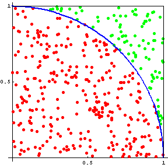

# Monte Carlo Pi - Secuencial y Paralelo

- David Mejía Restrepo

## Introducción
### Explicar algoritmo a paralelizar
El algoritmo viene del metodo de Monte Carlo que se puede usar para calcular un aproximado el numero *Pi*. **¿Cómo lo hace?** se tiene un cuadraro de lado *2r* un circulo dentro del cuadrado de radio *r*, luego se toman puntos aleatorios dentro del cuadrado y se revisa si el punto esta dentro o no del circulo[*Figura 1*], ahora para realizar el calculo de *Pi* se hace referencia a la formula en la [*Figura 2*].
<div align='center'>
    </br>
    </br><i>Figura 1. Ilustración metodo Monte Carlo</i>
    </br></br>
    </br><i>Figura 2. Formula metodo Monte Carlo</i>
    </br></br>
</div>

El algoritmo en la *Figura 3* se encarga de generar **p** cantidad de puntos con unas cordenadas dadas en **x** y **y**, luego se asegura que la hipotenusa del triangulo rectangulo que forman estos puntos sea menor o igual a 1 y de esta forma asegurar que este dentro del circulo, luego si esto se cumple, se encarga de sumar 1 a **counter** para saber cuantos puntos se obtuvieron dentro del circulo. [*Figura 4*]

``` c
double montecarlo_seq (int p) {  
  int i, counter = 0;
  double x, y, z, pi;

  // Computation of pi
  for(i = 0; i < p; ++i) {
    x = (double)rand() / RAND_MAX;
    y = (double)rand() / RAND_MAX;
    z = x * x + y * y;
    if( z <= 1 ) counter++;
  }
  pi = (double) counter / p * 4;

  return pi;
}
``` 
*Figura 3. Código Secuencial Monte Carlo.*
<div align='center'>
    
    </br><i>Figura 4. Cálculo del metodo Monte Carlo</i>
    </br></br>
</div>

## Método
### Explicación de la estrategia de paralelización.

### Explicación de la implementación de la estrategia en OpenMP.

## Resultados
### Presentación de los resultados de la ejecución.
### Perfiles de Speedup y eficiencia usando (1, 2, 4, 8 y 16 hilos).
## Conclusiones
### ¿Qué conclusiones pueden ser formulada a partir de los resultados obtenidos?