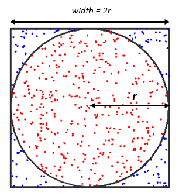

# Monte Carlo Pi - Secuencial y Paralelo

- David Mejía Restrepo

## Introducción
El algoritmo viene del metodo de Monte Carlo que se puede usar para calcular un aproximado el numero *Pi*. **¿Cómo lo hace?** se tiene un cuadraro de lado *2r* un circulo dentro del cuadrado de radio *r*, luego se toman puntos aleatorios dentro del cuadrado y se revisa si el punto esta dentro o no del circulo[*Figura 1*], ahora para realizar el calculo de *Pi* se hace referencia a la formula en la [*Figura 2*].
<div align='center'>
    </br>
    </br><i>Figura 1. Ilustración metodo Monte Carlo</i>
    </br></br>
    </br><i>Figura 2. Formula metodo Monte Carlo</i>
    </br></br>
</div>

El algoritmo en la *Figura 3* se encarga de generar **p** cantidad de puntos con unas cordenadas dadas en **x** y **y**, luego se asegura que la hipotenusa del triangulo rectangulo que forman estos puntos sea menor o igual a 1 y de esta forma asegurar que este dentro del circulo, luego si esto se cumple, se encarga de sumar 1 a **counter** para saber cuantos puntos se obtuvieron dentro del circulo. [*Figura 4*]

``` c
double montecarlo_seq (int p) {  
  int i, counter = 0;
  double x, y, z, pi;

  // Computation of pi
  for(i = 0; i < p; ++i) {
    x = (double)rand() / RAND_MAX;
    y = (double)rand() / RAND_MAX;
    z = x * x + y * y;
    if( z <= 1 ) counter++;
  }
  pi = (double) counter / p * 4;

  return pi;
}
``` 
*Figura 3. Código Secuencial Monte Carlo.*

<div align='center'>
    
    </br><i>Figura 4. Cálculo del metodo Monte Carlo</i>
    </br></br>
</div>

## Método

Para realizar la paralelización del metodo de Monte Carlo, se utilizo un *paralelismo a nivel de datos* (donde se reparten los datos para cada procesador o thread), para esto se utilizo la API de **OpenMP** dado que soporta el sistemas de *memoria compartida multiprocessing*, para esto se le reparten la cantidad de puntos a analizar a cada *thread*, luego sumar los puntos que conto cada *thread* y luego con base a estos numeros calcular el aproximado al numero *Pi*.

Para la implementación de la paralelización del codigo mostrado en la *Figura 5* se tuvieron que realizar algunos cambios antes de empezar el proceso de paralelización, como lo fue el cambio de la funcion [**rand()**](https://linux.die.net/man/3/srand) dado a que es *not reentrant or thread-safe* o en otras palabras que no es posible usarlas de manera segura u optima en programas con multiples hilos, el cambio de **rand()** fue por la funcion *thread-safe* **rand_r()**, a parte del cambio anterior mente mensionado se generaron multiples nuevas variables para manejar datos privados de cada hilo como lo son *local_counter*, quien cumple la funcion de *counter* de la funcion secuencial pero para cada hilo; *local_p*, que se encarga de contar cuantos puntos va a analizar cada hilo; *new_p*, su funcion ecencialmente es dividir por el numero de puntos analizados cuando la suma de todos los *local_p* es menor *p*; y *my_rank*, la cual se encarga de identificar cada hilo.
La etiqueta **#pragma omp parallel** es la encargada de empezar la paralelización, a la cual se le indican el numero de hilos a ejecutar **num_threads(n_threads)**, luego se indican cuales son las variables compartidas, para asi evitar las race condition sobre esas variables con **shared(counter)**, y luego las variables privadas de cada hilo con **private(x, y, z, i, my_rank)** y **firstprivate(local_counter, local_p)** para adicionalmente a indicar que *local_counter* y *local_p* son variables pivadas, les asignara el valor inicial correspondiente a cada una. Luego se asigna el valor a *my_rank* correspondiente a cada hilo y se genera una nueva variable local para modificar la generación de numeros aleatorios de cada hilo, esto en la linea `unsigned int local_seed = seed * (my_rank+1);`, luego cada hilo procede a realizar un ciclo for donde genera puntos aleatorios con semillas diferetes *local_seed* para la funcion *rand_r()* y contar los puntos que cumplen la condicion en su variable *local_counter*, y finaliza cada uno sumando su variable *local_counter* en la variable compartida *counter*, inmediatamente despues de que cada hilo termine se calcula *pi* con base a la variable *counter* y *new_p*.

``` c
double montecarlo_par (int p, int n_threads, unsigned int seed) {
  
  int i, local_p, local_counter, counter, my_rank, new_p;
  double x, y, z, pi;
  
  local_counter = 0;
  counter = 0;
  local_p = p / n_threads;
  new_p = local_p * n_threads;

  #pragma omp parallel \
    num_threads(n_threads) \
    shared(counter) \
    private (x, y, z, i, my_rank) \
    firstprivate(local_counter, local_p)
  {
    my_rank = omp_get_thread_num();
    unsigned int local_seed = seed * (my_rank+1);
    
    for(i = 0; i < local_p; ++i) {
      x = (double)rand_r(&local_seed) / RAND_MAX;
      y = (double)rand_r(&local_seed) / RAND_MAX;
      z = x * x + y * y;
      if( z <= 1 )
        local_counter++;
    }
    counter += local_counter;
  }
  pi = (double) counter / new_p * 4;
  
  return pi;
}
```
*Figura 5. Código Paralelo Monte Carlo.*

## Resultados
### Presentación de los resultados de la ejecución.

### Perfiles de Speedup y eficiencia usando (1, 2, 4, 8 y 16 hilos).

## Conclusiones
### ¿Qué conclusiones pueden ser formulada a partir de los resultados obtenidos?
